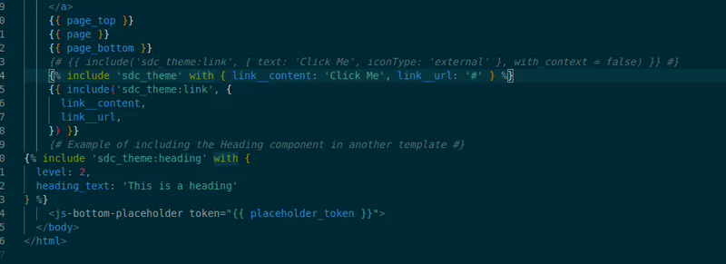

# Drupal SDC Helper

**Enhance your Drupal 10 development workflow with autocomplete and navigation support for Single Directory Components (SDC) in Twig files.**

Developed during Guild Day @ [wunder.io](https://wunder.io/)



## Configuration

The extension works by indexing the .twig components within components directories. Make sure to adjust the paths for the directories relative to the workspace (settings).
Index is regenrated when a component (.twig) is saved.

**Example:**

```json
"drupalSDC.componentDirectories": [
  "web/themes/custom/*/components/**",
  "web/modules/custom/*/components/**"
]
```

## Features

- **Autocomplete Component IDs**: Get suggestions for component IDs while typing `include`, `embed`, or `include` statements in Twig files.
- **Go-to Definition**: Use `Ctrl + Click` to navigate directly to the component's definition file.

## Usage

- Open a Twig file in your Drupal project.
- Start typing an `include` or `embed` statements and autofill options should be presented when typing `:` symbol.
- Press `Enter` to accept a suggestion.
- Hold `Ctrl` and click on a component ID to open its definition file.
